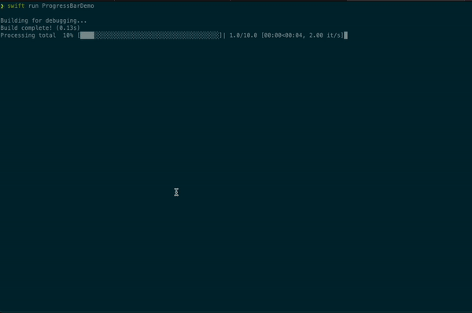

# TQDMProgressBar

TQDMProgressBar is a Swift package that provides a customizable progress bar for command-line interfaces, inspired by Python's TQDM library. It offers a simple and flexible way to add progress indicators to your Swift applications.



## Features

- Easy to use with sequences, async sequences, and manual updates
- Customizable appearance with various styles and colors
- Support for different bar formats
- Unit scaling for easy representation of file sizes, etc.
- Async/await support for modern Swift concurrency

## Installation

### Swift Package Manager

Add the following to your `Package.swift` file:

```swift
dependencies: [
    .package(url: "https://github.com/engali94/TQDMProgressBar.git", from: "0.1")
]
```

## Usage

### Basic Usage

```swift
import TQDMProgressBar

let total = 100
let bar = ProgressBar(total: total, desc: "Processing")
for _ in 0..<total {
    // Do some work
    Thread.sleep(forTimeInterval: 0.1)
    bar.update(1)
}
bar.close()
```

### Using with Sequences

```swift
let numbers = Array(1...100)
let progressBar = ProgressBar(sequence: numbers, desc: "Processing")
for number in progressBar.iterate(numbers) {
    // Process each number
    Thread.sleep(forTimeInterval: 0.1)
}
```

### Async Support

```swift
let bar = ProgressBar(total: 100, desc: "Async processing")
try await bar.forEach {
    try await someAsyncOperation()
}
```

### Customizing Appearance

```swift
var style = ProgressBarStyle.default
style.fill = "█"
style.emptyFill = "░"
style.barColor = .cyan
style.descColor = .green

let bar = ProgressBar(total: 100, desc: "Custom style", style: style)
// Use the bar...
```

## API Reference

### ProgressBar

- `init(total:desc:style:)`: Initialize a progress bar with a known total
- `init(sequence:desc:style:)`: Initialize a progress bar for a sequence
- `update(_:)`: Update the progress
- `close()`: Close the progress bar
- `setDescription(_:)`: Set a new description
- `setPostfix(_:)`: Set a new postfix
- `forEach(_:)`: Execute a closure for each iteration
- `track(_:)`: Track progress of an async operation

### ProgressBarStyle

- `barFormat`: Format of the progress bar
- `fill`: Character for filled portion
- `emptyFill`: Character for empty portion
- `barColor`: Color of the bar
- `descColor`: Color of the description

## Contributing

Contributions are welcome! Please feel free to submit a Pull Request.

## License